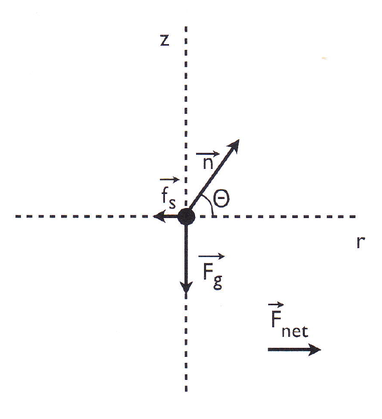

# {{ params.vars.title }}

## Part 1

The image shows the free-body diagram of an object in circular motion with speed v and radius r.
The net force is along the radial direction.
The component of Newton's second law along the radial direction is:

### Answer Section

- {{ params.part1.ans1.value }}
- {{ params.part1.ans2.value }}
- {{ params.part1.ans3.value }}
- {{ params.part1.ans4.value }}
- {{ params.part1.ans5.value }}
- {{ params.part1.ans6.value }}

## Attribution

Problem is licensed under the [CC-BY-NC-SA 4.0 license](https://creativecommons.org/licenses/by-nc-sa/4.0/).  