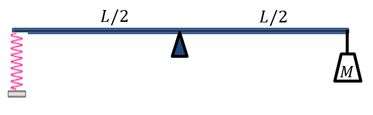

# {{ params_vars_title }}
The figure shows a mass $M$ attached to the right end of a rod of length $L$ and of mass $m$. There is a support located at the middle of the rod. The left end of the rod is connected to a spring. The system is in static equilibrium.

## Part 1

Determine the magnitude of the vertical force exerted on the rod by the spring ($F_S$).

Use the following table as a reference for each variable. Note that it may not be necessary to use every variable.

| For  | Use   |
|----------|-------|
| $M$  | M  |
| $L$  | L  |
| $m$  | m  |
| $g$  | g  |

### Answer Section

Please enter in a symbolic value in {{ params_vars_unit1 }}.

## Part 2

Determine the direction, $\theta$, of the vertical force exerted on the rod by the spring ($F_S$). Assume that the left end of the rod is at the origin of a Cartesian plane ($\theta > 0$ with zero being to the right).

### Answer Section

Please enter in a numeric value in {{ params_vars_unit2 }}.

## Part 3

Find the magnitude of the normal force exerted on the rod by the support ($n$).

Use the following table as a reference for each variable. Note that it may not be necessary to use every variable.

| For  | Use   |
|----------|-------|
| $M$  | M  |
| $L$  | L  |
| $m$  | m  |
| $g$  | g  |

### Answer Section

Please enter in a symbolic value in {{ params_vars_unit1 }}.

## Part 4

On the figure, indicate which pivot point have you chosen to answer Part 1. In addition, show the direction of $F_S$ determined in Part 2.

Your file must be a pdf.

### Answer Section

File upload box will be shown here.

## Attribution

Problem is licensed under the [CC-BY-NC-SA 4.0 license](https://creativecommons.org/licenses/by-nc-sa/4.0/).  