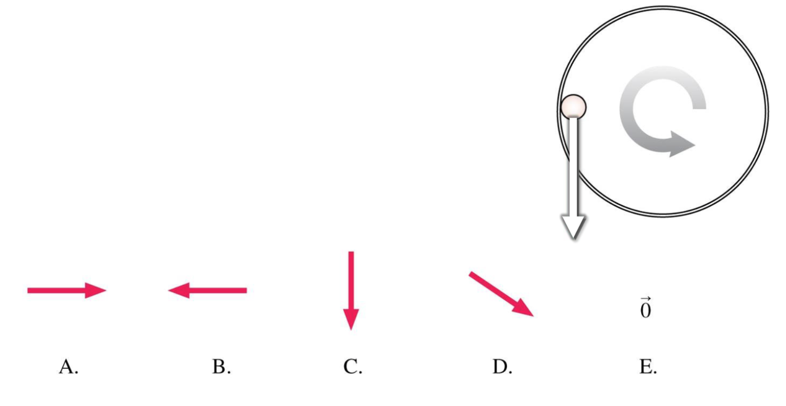

# {{ params_vars_title }}
A ball rolls counterclockwise around the inside of a horizontal pipe.
The ball is fastest at the lowest point, slowest at the highest point.

## Part 1

At the point shown, with the ball moving down (the white arrow shows the ball's instantaneous velocity), what is the direction of the net force on the ball?

### Answer Section

- {{ params_part1_ans1_value }}
- {{ params_part1_ans2_value }}
- {{ params_part1_ans3_value }}
- {{ params_part1_ans4_value }}
- {{ params_part1_ans5_value }}

## Attribution

Problem is licensed under the [CC-BY-NC-SA 4.0 license](https://creativecommons.org/licenses/by-nc-sa/4.0/).  