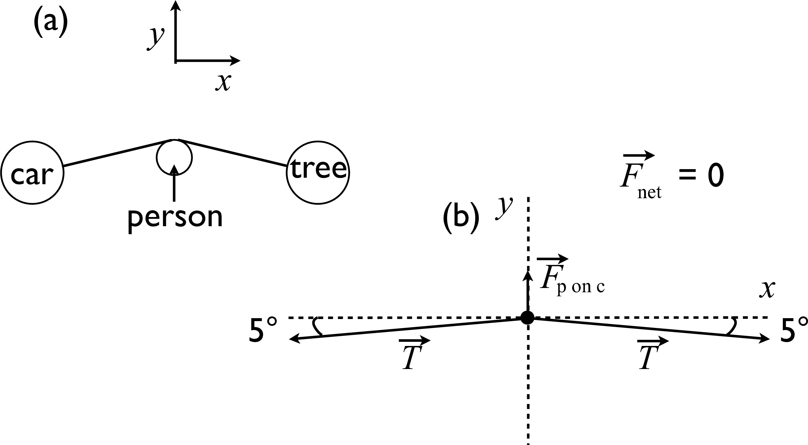

# {{ params_vars_title }}
One way to move a heavy object (like a car) is to attach a strong chain between it and a strong tree and push perpendicular to the chain (see Fig. (a)) to create a large tension. A free body diagram of a piece of the chain is shown in Fig. (b).

## Part 1

If the person pushes on the chain with a force of {{ params_F }} {{ params_vars_units }}, the tension in the chain is:

### Answer Section

Please enter in a numeric value in {{ params_vars_units }}.

## Attribution

Problem is licensed under the [CC-BY-NC-SA 4.0 license](https://creativecommons.org/licenses/by-nc-sa/4.0/).  