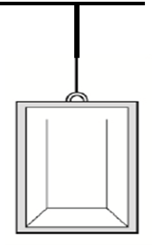

# {{ params.vars.title }}
The figure shows an elevator hanging from a cable. This elevator is coming to a stop while ascending.

## Part 1

Identify the system and draw a closed curve around it. (Save the image above, and upload your edited version.)

### Answer Section

## Part 2

Draw the free body diagram for the system modeled as a particle. Name and label all relevant contact and long-range forces on the system. In addition, show the net force acting on the system.

### Answer Section

## Attribution

Problem is licensed under the [CC-BY-NC-SA 4.0 license](https://creativecommons.org/licenses/by-nc-sa/4.0/).  