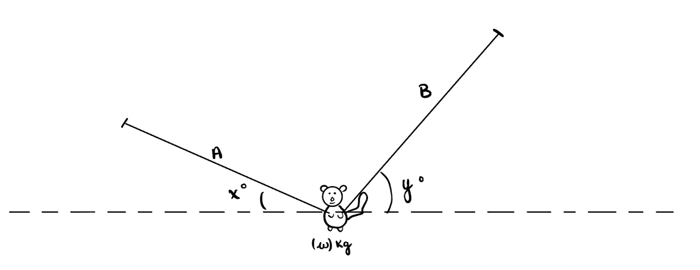

# Forces acting on a Squirrel
A squirrel with a mass of ${{ params_m }}\ \rm{kg}$ is hanging at rest between two branches **A** and **B** with an angle of ${{ params_x}}^{\circ}$ and ${{ params_y }}^{\circ}$ respectively.
 

## Part 1

Draw the FBD and determine the tension in branch **A**.

### Answer Section

Please enter the tension in branch A in N.

## Part 2

Determine the tension in branch **B**.

### Answer Section

Please enter the tension in branch B in N.

## Attribution

Problem is licensed under the [CC-BY-NC-SA 4.0 license](https://creativecommons.org/licenses/by-nc-sa/4.0/).  