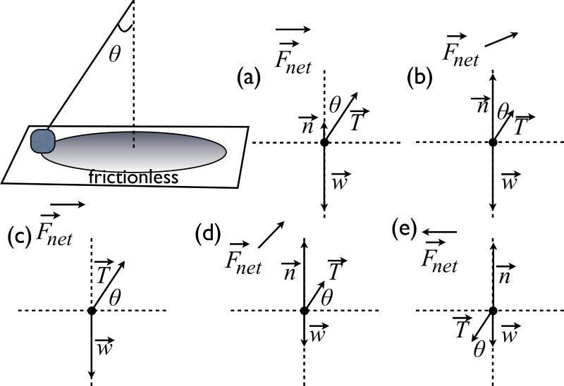

# {{ params.vars.title }}
A mass on the end of a string is swung around a circle across a horizontal frictionless table. The angle the string makes with respect to the vertical is $\theta$. Choose the best free body diagram from the choices provided in the figure.

## Part 1

### Answer Section

- {{ params_part1_ans1_value }} {{ params.vars.units}}
- {{ params_part1_ans2_value }} {{ params.vars.units}}
- {{ params_part1_ans3_value }} {{ params.vars.units}}
- {{ params_part1_ans4_value }} {{ params.vars.units}}
- {{ params_part1_ans5_value }} {{ params.vars.units}}

## Attribution

Problem is licensed under the [CC-BY-NC-SA 4.0 license](https://creativecommons.org/licenses/by-nc-sa/4.0/).  