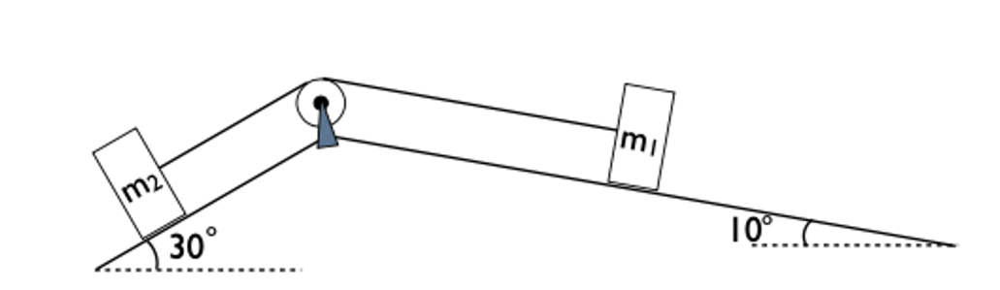

# {{ params_vars_title }}
Two masses $m_1=$ {{ params_m1 }} $\rm{kg}$ and $m_2=$ {{ params_m2 }} $\rm{kg}$ are connected by a light rope which passes over a light, low friction pulley between low friction slopes of $30^\circ$ and $10^\circ$ as shown in the figure. Approximating the masses of the rope and pulley to be negligible and the friction of both the slopes and the pulley to be negligible, find the acceleration of mass $m_2$ up the slope.

## Part 1

Show your work to find the acceleration by drawing free body diagrams, axes and acceleration vectors, and write Newton's second law equations in components independently for both masses. Upload the image as a pdf, and title it "part1.pdf".

### Answer Section

File upload box will be shown here.

## Part 2

The acceleration of $m_2$ is:

### Answer Section

Please enter in a numeric value in {{ params_vars_units }}.

## Attribution

Problem is licensed under the [CC-BY-NC-SA 4.0 license](https://creativecommons.org/licenses/by-nc-sa/4.0/).  