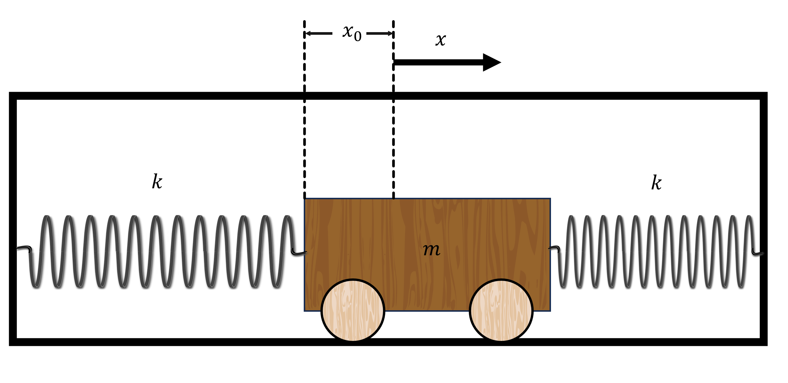

# Spring Oscillator
A wooden train is attached to two linear springs of spring constant $k$ in a closed box. The train is displaced from the center of the box by $x_0 \ \rm{m}$.

## Part 1

If the train is released from rest and it moves along the frictionless floor, what is the total force in the x-direction acting on the train at the point of release? 
$m= {{ params_m }} \ \rm{kg}$, $x\_{0}= {{ params.x_0 }} \ \rm{cm}$, $k = {{ params_k }} \ \rm{Nm^{-1}}$.

### Answer Section

Please enter in a numeric value in $N$.

## Part 2

What is the maximum acceleration of the train?

### Answer Section

Please enter in a numeric value in $ms^{-2}$.

## Part 3

By obtaining the displacement of the train as a function of time, determine the period of oscillation of the train i.e the time that it takes for the train to return back to its starting position.

### Answer Section

Please enter in a numeric value in $s$.

## Part 4

If the spring stiffness constant is quadrupled, what is the new period of oscillation?

### Answer Section

Please enter in a numeric value in $s$.

## Attribution

Problem is licensed under the [CC-BY-NC-SA 4.0 license](https://creativecommons.org/licenses/by-nc-sa/4.0/).  