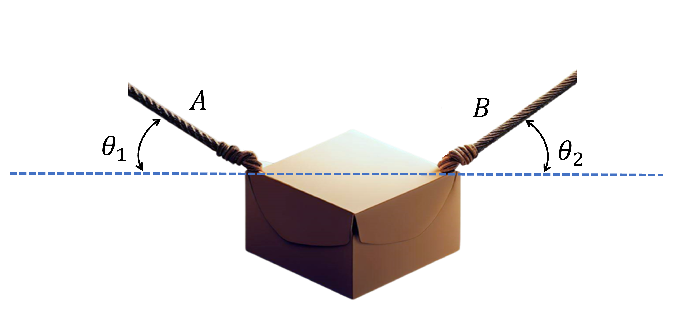

# Forces acting on a Squirrel
A box, suspended by two ropes and possessing a mass of ${{ params_m }}\ \rm{kg}$, remains stationary between two attachment points, referred to as $\rm{A}$ and $\rm{B}$. The ropes form angles of ${{ params_x}}^{\circ}$ and ${{ params_y }}^{\circ}$ with the horizontal at these points, respectively. 

## Part 1

Draw the FBD and determine the tension in the rope connecting to point $\rm{A}$.

### Answer Section

Please enter the tension in rope connecting to point $\rm{A}$ in $\rm{N}$.

## Part 2

Determine the tension in the rope connecting to point $\rm{B}$.

### Answer Section

Please enter the tension in rope connecting to point $\rm{B}$ in $\rm{N}$.

## Attribution

Problem is licensed under the [CC-BY-NC-SA 4.0 license](https://creativecommons.org/licenses/by-nc-sa/4.0/).  