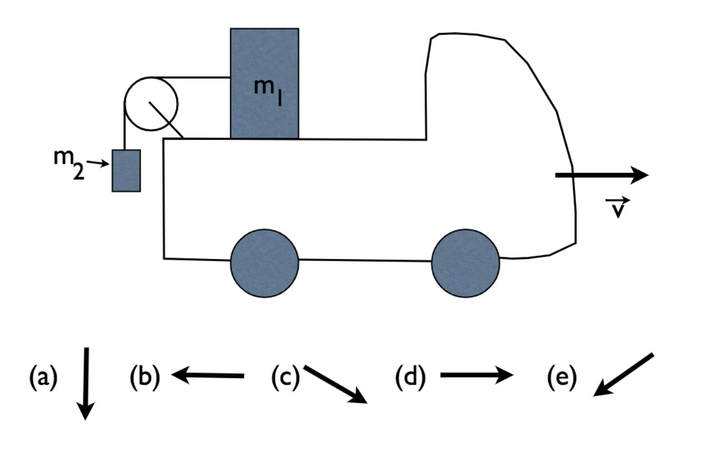

# {{ params_vars_title }}
A truck moving at a constant velocity has a mass $m_1$ in its back connected by a massless frictionless pulley to a hanging mass $m_2$ as shown in the image.

## Part 1

What direction is the acceleration of the mass $m_2$? (You may assume that the force of friction between the mass $m_1$ and the back of the truck is negligible).

### Answer Section

- {{params_part1_ans1_value}}
- {{params_part1_ans2_value}}
- {{params_part1_ans3_value}}
- {{params_part1_ans4_value}}
- {{params_part1_ans5_value}}

## Attribution

Problem is licensed under the [CC-BY-NC-SA 4.0 license](https://creativecommons.org/licenses/by-nc-sa/4.0/).  