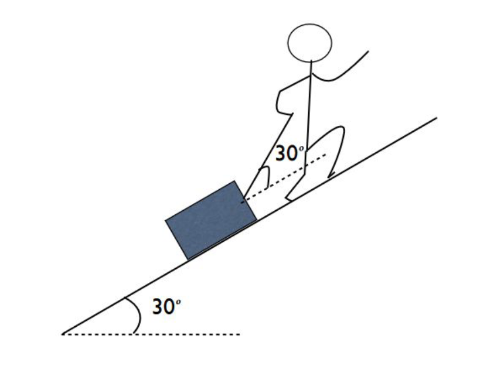

# {{ params_vars_title }}
An environmental physicist working in the Arctic pulls their supplies up a steep ($\theta = 30^\circ$ above the horizontal) snow-covered slope. The rope that they pull with is at an angle $\theta = 30^\circ$ above the angle of the slope (see figure below). The coefficient of kinetic friction between the supplies and the slope is $\mu_k = {{ params_uk }}$. They maintain a constant velocity up the hill.

## Part 1

Draw a force identification diagram for their supplies. Be sure to identify the tension $\vec{T}$, the normal force $\vec{n}$, the weight $\vec{W}$, the force of friction $\vec{f_k}$, and any other forces acting on the supplies. Do this by downloading the given diagram (right-click $\to$ save image as), and uploading a photo of your annotated copy as a pdf, with the name "part1.pdf".

### Answer Section

File upload box will be shown here.

## Part 2

Draw a free body diagram for their supplies. Be sure to label all of the forces identified in Part 1. (*Hint: choose the x-axis to be parallel to the slope and the y-axis perpendicular to the slope*). Upload a photo of your work as a pdf, with the name "part2.pdf".

### Answer Section

File upload box will be shown here.

## Part 3

Write Newton's 2nd law for the forces parallel to the slope.

Note that it may not be necessary to use every variable. Use the following table as a reference for each variable:

| For      | Use   |
|----------|-------|
| $T$      | T     |
| $W$      | W     |
| $n$      | n     |
| $f_k$    | f_k   |
| $\theta$ | theta |

### Answer Section

## Part 4

Write Newton's 2nd law for the forces perpendicular to the slope.

Note that it may not be necessary to use every variable. Use the following table as a reference for each variable:

| For      | Use   |
|----------|-------|
| $T$      | T     |
| $W$      | W     |
| $n$      | n     |
| $f_k$    | f_k   |
| $\theta$ | theta |

### Answer Section

## Part 5

If the mass of their supplies is {{ params_m }} $\rm{kg}$, solve your equations to find the normal force on the supplies. (*Hint: you will need to eliminate the tension and express $f_k$ in terms of the normal force*).

### Answer Section

Please enter in a numeric value in {{ params_vars_units }}.

## Part 6

Find the magnitude of the kinetic force of friction on the supplies.

### Answer Section

Please enter in a numeric value in {{ params_vars_units }}.

## Part 7

Solve your equations to find the tension in the rope.

### Answer Section

Please enter in a numeric value in {{ params_vars_units }}.

## Attribution

Problem is licensed under the [CC-BY-NC-SA 4.0 license](https://creativecommons.org/licenses/by-nc-sa/4.0/).  