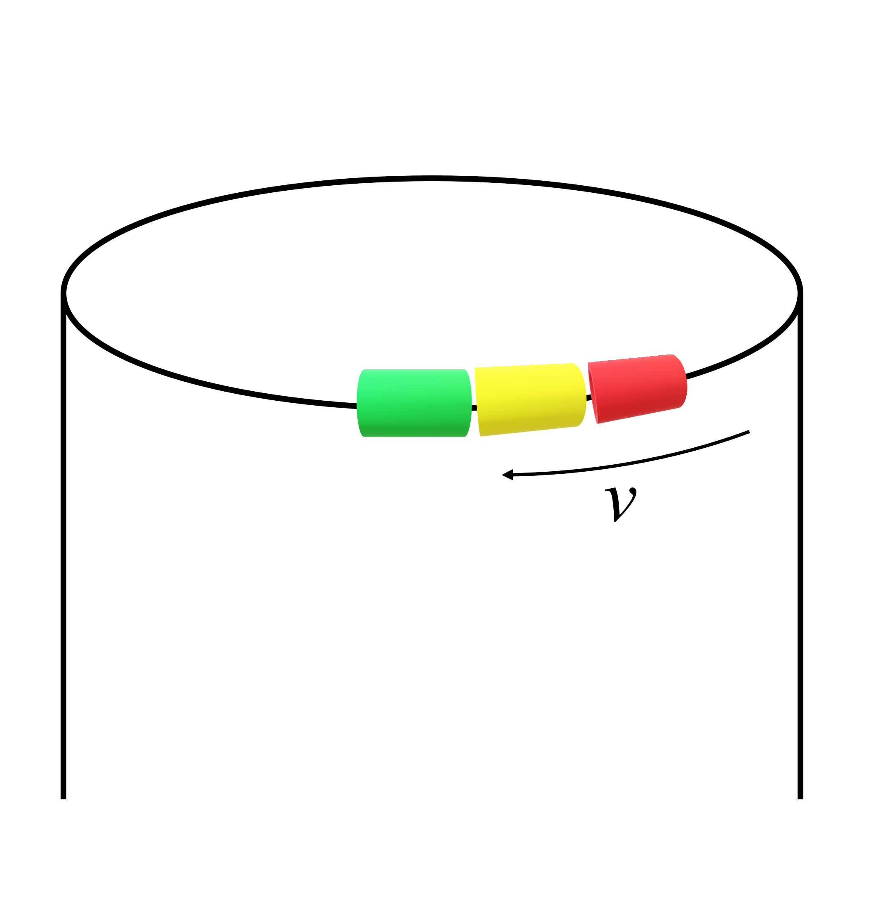

# {{ params.vars.title }}

A common toy for children is a bent metal track upon which children push beads.
On this specific track, a set of beads is pushed in a simple circle, with radius $r = {{ params.r }} \ \rm{cm}$.
If the beads are spun around fast, with an initial velocity $v = {{ params.v }} \ \rm{m/s}$, how far will it travel before it stops? Assume the coefficient of friction is $\mu = {{ params.mu }}$.

## Part 1

How far do the beads travel?

### Answer Section

Please enter in a numeric value in $\rm{m}$.

## Attribution

Problem is licensed under the [CC-BY-NC-SA 4.0 license](https://creativecommons.org/licenses/by-nc-sa/4.0/).  