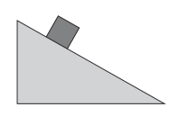

# {{ params.vars.title }}
A mass of {{params.m}} $kg$ sits at rest on an incline making an angle of {{params.theta}} $^\circ$ with respect to the horizontal.

## Part 1

If $\mu_s$ = {{params.mu}}, what is the friction force on the block?
Choose the best answer.

### Answer Section

- {{ params.part1.ans1.value }}
- {{ params.part1.ans2.value }}
- {{ params.part1.ans3.value }}
- {{ params.part1.ans4.value }}
- {{ params.part1.ans5.value }}

## Attribution

Problem is licensed under the [CC-BY-NC-SA 4.0 license](https://creativecommons.org/licenses/by-nc-sa/4.0/).  