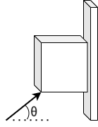

# {{ params.vars.title }}
A {{params.m}} kg wood block slides down a vertical wall while you push on it at a {{params.theta}}$^\circ$ angle.

## Question Text

What magnitude force should you apply to cause the block to slide down at constant speed? The coefficient of kinetic friction is $\mu_k$ = {{params.mu}}.

### Answer Section

Please enter in a numeric value in {{ params.vars.units }}.

## Attribution

Problem is licensed under the [CC-BY-NC-SA 4.0 license](https://creativecommons.org/licenses/by-nc-sa/4.0/).  