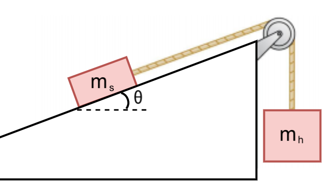

# {{ params.vars.title }}
The figure shows a block of mass $m$ resting on a {{params.theta}} $^\circ$ slope.
The coefficient of static friction between the block and the sloped surface is {{params.mu}}.
It is connected via a massless string over a massless, frictionless pulley to a hanging block of mass {{params.m}} $kg$.

## Question Text

What is the _minimum_ value of $m$ such that the system remains at rest?

### Answer Section

Please enter in a numeric value in {{ params.vars.units }}.

## Attribution

Problem is licensed under the [CC-BY-NC-SA 4.0 license](https://creativecommons.org/licenses/by-nc-sa/4.0/).  