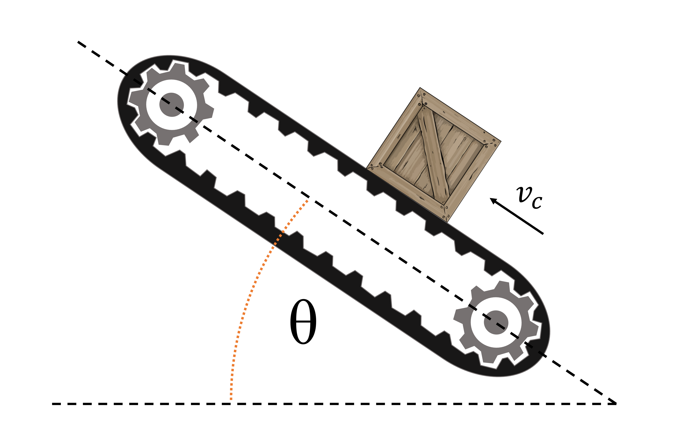

# {{ params_vars_title }}

A conveyor belt, angled at $\theta = {{ params_theta }}^{\circ}$, carries packages up an incline.
What must the coefficient of friction be to prevent the packages from slipping as they move?
Assume the conveyor belt runs at $v = {{ params_v }} \ \rm{ft/s}$  and the package has a smooth transition onto the belt.

## Part 1

What is the coefficient of friction?

### Answer Section

Please enter in a numeric value in $\rm{m/s}$.

## Part 2

If the direction of the conveyor belt was downwards, would the coefficient need to be greater, less than, or the same?

### Answer Section

- {{ params_part2_ans1_value}}
- {{ params_part2_ans2_value}}
- {{ params_part2_ans3_value}}

## Attribution

Problem is licensed under the [CC-BY-NC-SA 4.0 license](https://creativecommons.org/licenses/by-nc-sa/4.0/).  