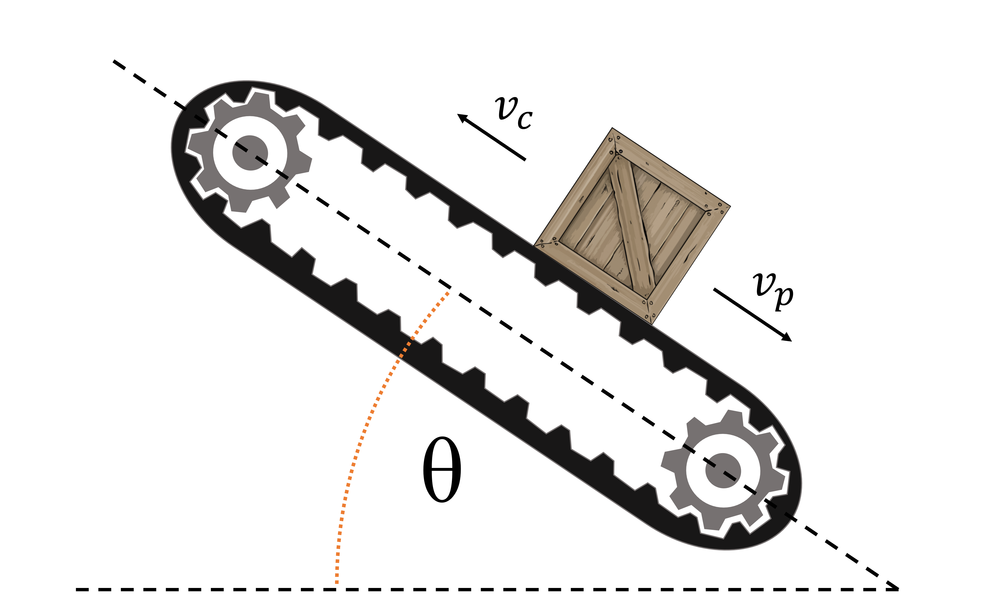

# {{ params_vars_title }}

A conveyor belt, angled at $\theta = {{ params_theta }}^{\circ}$, carries packages up an incline.
The package aboard it slips and begins moving downwards at a constant speed $v_p = {{ params_v }} \ \rm{ft/s}$ relative to the ground.
Given that friction can be found as $F = Cv\_{PC}$, where $C$ is a constant ${{ params_C }}$.
$v\_{PC}$  is the relative velocity of the package to the conveyor.\
The package has a weight of $W = {{ params_W }} \ \rm{lb}$.

## Part 1

What is the speed of the conveyor?

### Answer Section

Please enter in a numeric value in $\rm{m/s}$.

## Attribution

Problem is licensed under the [CC-BY-NC-SA 4.0 license](https://creativecommons.org/licenses/by-nc-sa/4.0/).  