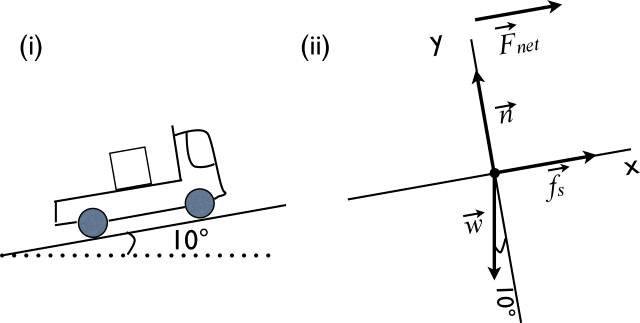

# {{ params.vars.title }}
A truck accelerates up a 10  $^\circ$  incline. For a box in the back of the truck as shown in Fig. (i), the free body diagram is shown in Fig. (ii). The coefficient of friction between the box and the truck is $\mu_s$ . At the point of slipping, the acceleration of the truck is:

## Part 1

### Answer Section

- {{ params_part1_ans1_value }} {{ params.vars.units}}
- {{ params_part1_ans2_value }} {{ params.vars.units}}
- {{ params_part1_ans3_value }} {{ params.vars.units}}
- {{ params_part1_ans4_value }} {{ params.vars.units}}
- {{ params_part1_ans5_value }} {{ params.vars.units}}

## Attribution

Problem is licensed under the [CC-BY-NC-SA 4.0 license](https://creativecommons.org/licenses/by-nc-sa/4.0/).  