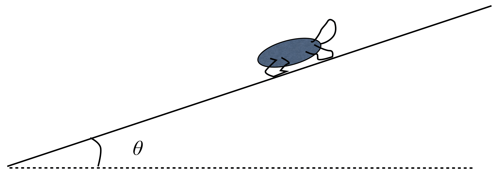

# {{ params.vars.title }}
A turtle lies on a log in the sun as shown in the figure below.
The turtle has mass $\rm m$, the log makes an angle $\theta$ with respect to the horizontal and the coefficient of static friction between the turtle and the log is $\mu_s$ (where $\mu_s > \tan\theta$).

## Part 1

The magnitudes of the normal force, $n$ and the frictional force $f_s$ are:

### Answer Section

- {{ params.part1.ans1.value }}
- {{ params.part1.ans2.value }}
- {{ params.part1.ans3.value }}
- {{ params.part1.ans4.value }}
- {{ params.part1.ans5.value }}

## Attribution

Problem is licensed under the [CC-BY-NC-SA 4.0 license](https://creativecommons.org/licenses/by-nc-sa/4.0/).  