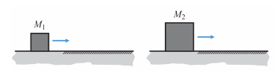

# {{ params_vars_title }}
Two blocks, $M_1$ \< $M_2$, having the same initial speed, move from a frictionless surface onto a surface having a coefficient of kinetic friction $\mu_k$.

## Part 1

Which stops in a shorter distance?

### Answer Section

- {{ params_part1_ans1_value }}
- {{ params_part1_ans2_value }}
- {{ params_part1_ans3_value }}
- {{ params_part1_ans4_value }}

## Attribution

Problem is licensed under the [CC-BY-NC-SA 4.0 license](https://creativecommons.org/licenses/by-nc-sa/4.0/).  