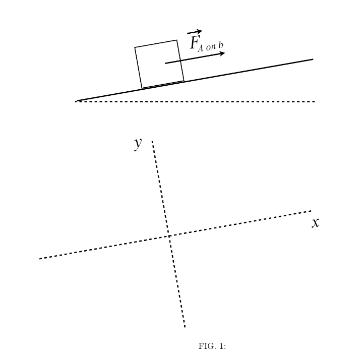

# {{ params.vars.title }}
On moving day, {{params.vars.name}} pushes a box weighing {{params.f}} $\rm{N}$ at constant speed up a ramp. They push parallel to the ramp with a force of magnitude $F\_{\textit{A on B}}$ (see the figure below). The ramp makes an angle of $\theta = {{params.ang}}^{\circ}$ with the horizontal direction. The coefficients of static and kinetic friction friction between the box and the ramp are $\mu_s = {{params.s}}$ and  $\mu_k = {{params.k}}$, respectively.

## Question Text

Draw a free body diagram for this problem using the labelled axes provided in the figure. Label each force with subscripts indicating the agent of the force and the force on which it acts. Use R for ramp, A for {{params.vars.name}}, E for earth, and B for box. Be sure to consider the force {{params.vars.name}} exerts on the box $F\_{\textit{A on B}}$, the force of kinetic friction $f\_{\textit{k, R on B}}$, the force of static friction $f\_{\textit{s, R on B}}$, the weight of the box $W\_{\textit{E on B}}$, the normal force $N\_{\textit{R on B}}$, and any other forces that may be acting on the box.

### Answer Section

File upload box will be shown here.

## Part 2

Is this an example of static or dynamic equilibrium?

### Answer Section

- {{ params.part1.ans1.value }}
- {{ params.part1.ans2.value }}
- {{ params.part1.ans3.value }}

## Part 3

From your free body diagram, write Newton's second law equation for the x-components.

Note that it may not be necessary to use every variable and for angles, use their numeric value in degrees. Use the following table as a reference for each variable:

| For                      | Use   |
|--------------------------|-------|
| $F\_{\textit{A on B}}$    | F_ab  |
| $f\_{\textit{k, R on B}}$ | F_krb |
| $f\_{\textit{s, R on B}}$ | F_srb |
| $W\_{\textit{E on B}}$    | W_eb  |
| $N\_{\textit{R on B}}$    | N_rb  |
| $\theta$                 | theta |

### Answer Section

## Part 4

From your free body diagram, write Newton's second law equation for the y-components.

Note that it may not be necessary to use every variable and for angles, use their numeric value in degrees. Use the following table as a reference for each variable:

| For                      | Use   |
|--------------------------|-------|
| $F\_{\textit{A on B}}$    | F_ab  |
| $f\_{\textit{k, R on B}}$ | F_krb |
| $f\_{\textit{s, R on B}}$ | F_srb |
| $W\_{\textit{E on B}}$    | W_eb  |
| $N\_{\textit{R on B}}$    | N_rb  |
| $\theta$                 | theta |

### Answer Section

## Part 5

Solve your equations to find $F\_{\textit{A on B}}$.

### Answer Section

Please enter in a numeric value

## Part 6

If the box started at rest on the ramp, how hard would {{params.vars.name}} have to initially push the box to just overcome the static force of friction?

### Answer Section

Please enter in a numeric value

## Part 7

Once the box started moving, if {{params.vars.name}} maintained the force you found in Part 6, what would happen to the box?

### Answer Section

- {{ params.part1.ans1.value }}
- {{ params.part1.ans2.value }}
- {{ params.part1.ans3.value }}

## Attribution

Problem is licensed under the [CC-BY-NC-SA 4.0 license](https://creativecommons.org/licenses/by-nc-sa/4.0/).  