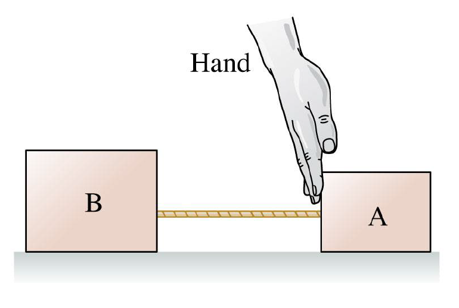

# {{ params.vars.title }}
The hand in the figure pushes the back of block A.
The blocks, with $m_B$ > $m_A$, are connected by a light string and slide on a frictionless surface.

## Part 1

The force of the string on B is:

### Answer Section

- {{ params.part1.ans1.value }}
- {{ params.part1.ans2.value }}
- {{ params.part1.ans3.value }}

## Attribution

Problem is licensed under the [CC-BY-NC-SA 4.0 license](https://creativecommons.org/licenses/by-nc-sa/4.0/).  