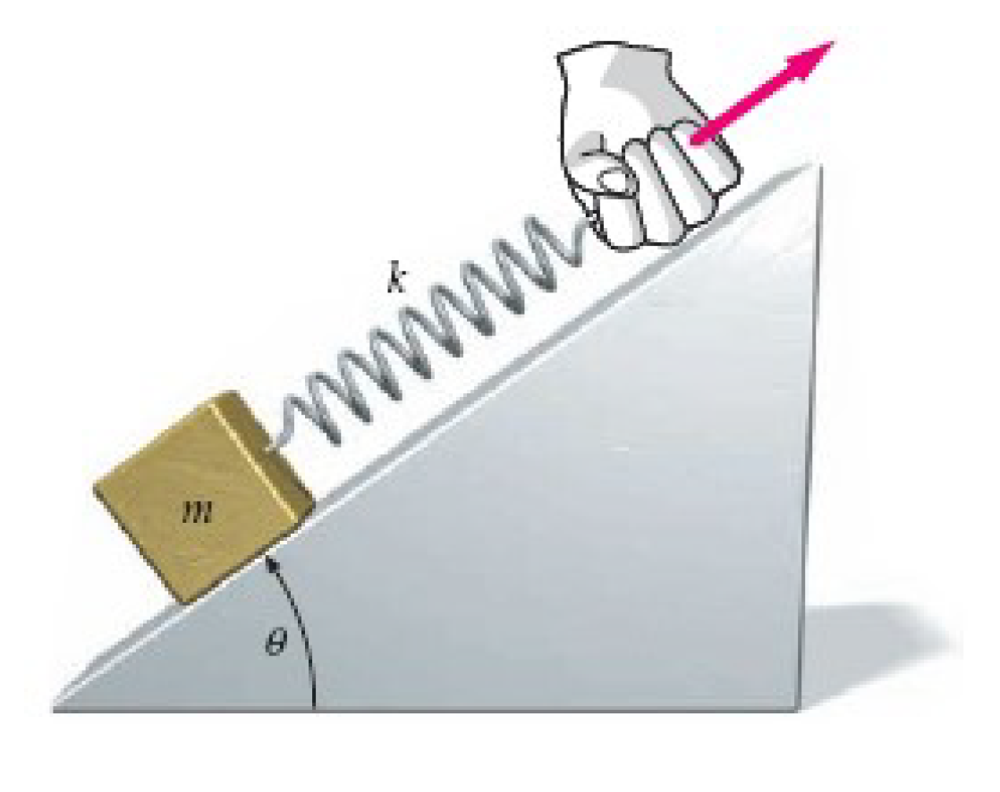

# {{ params.vars.title }}
In the figure below m = {{ params.m }} kg, $\theta$ = {{ params.theta }} $^\circ$, and k = {{ params.k }} N/m.
In this problem assume that the ramp never moves and that there is friction between the block and the ramp.

## Part 1

If the coefficient of static friction between the block and the ramp is $\mu_s$ = {{ params.us }}, what is the maximum amount that the spring can be stretched beyond its equilibrium length before the block begins to slide up the ramp?

### Answer Section

Please enter in a numeric value in {{ params.vars.units }}.

## Part 2

Suppose now that the block is sliding up the ramp at a constant velocity.
By what length is the spring stretched?
Assume that the coefficient of kinetic friction is $\mu_k$ = {{ params.uk }}.

### Answer Section

Please enter in a numeric value in {{ params.vars.units }}.

## Attribution

Problem is licensed under the [CC-BY-NC-SA 4.0 license](https://creativecommons.org/licenses/by-nc-sa/4.0/).  