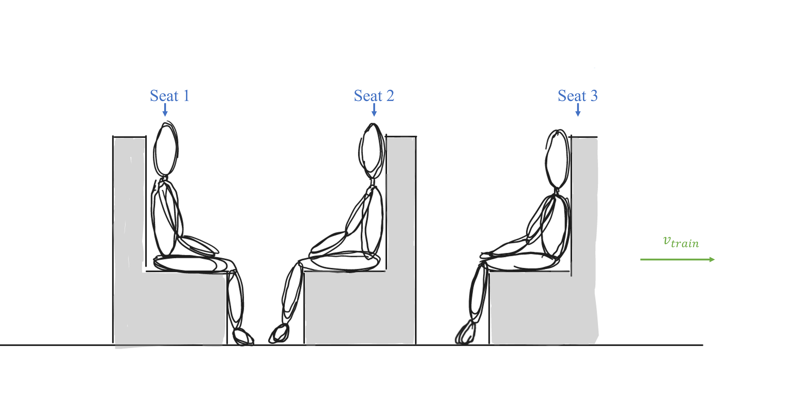

# Train Seats
A person on a train has three seating options to choose from; Seats 1,2, and 3.

## Part 1

In order to avoid injury and bodily harm during a rapid deceleration of the train which is moving to the right, what seat should the person choose? 
Assume, all three seats get occupied. 

### Answer Section

- {{ params_part1_ans1_value }}
- {{ params_part1_ans2_value }}
- {{ params_part1_ans3_value }}

## Attribution

Problem is licensed under the [CC-BY-NC-SA 4.0 license](https://creativecommons.org/licenses/by-nc-sa/4.0/).  