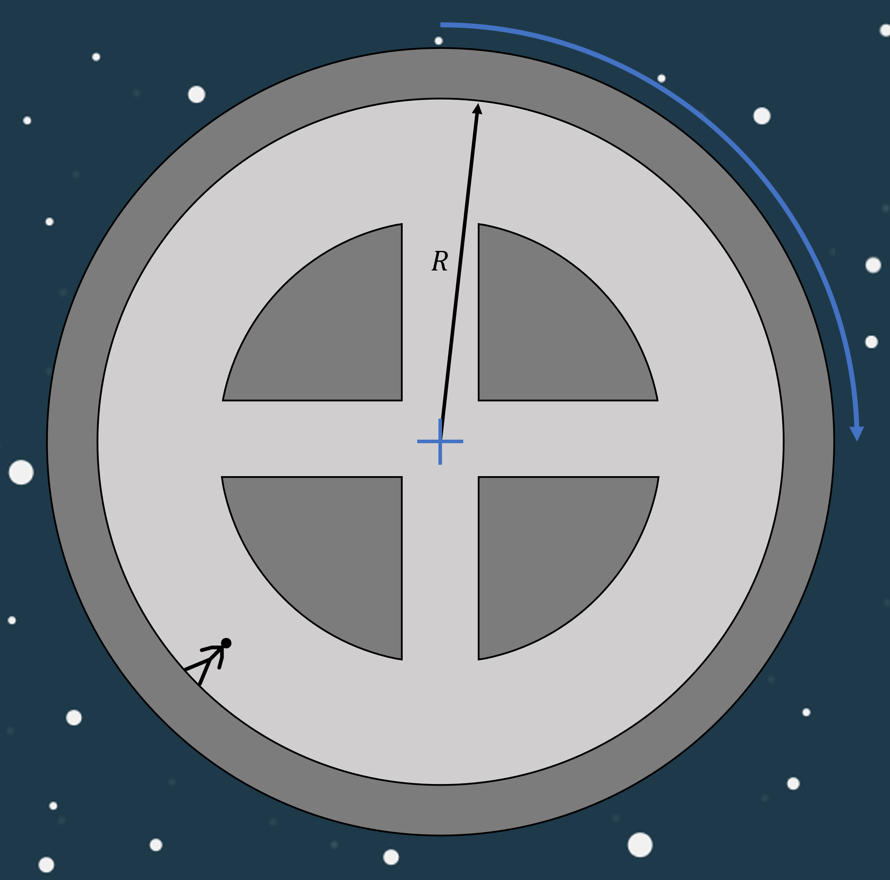

# {{ params_vars_title }}
To simulate the effects of "weight" in deep space, the spacecraft is made to rotate with the astronaut "standing" on the outer hull of a circular chamber. The artificial gravity experienced by the astronaut is the inertial reaction to the normal force pulling them to the center of rotation.

## Question Text

What is the rotational speed($v$) with which the rocket has to rotate to mimic earth's gravity($g$). 
$m = {{ params_m }}\ \rm{kg}$, $R = {{ params_r }}\ \rm{m}$

### Answer Section

Please enter in a numeric value in m/s.

## Attribution

Problem is licensed under the [CC-BY-NC-SA 4.0 license](https://creativecommons.org/licenses/by-nc-sa/4.0/).  