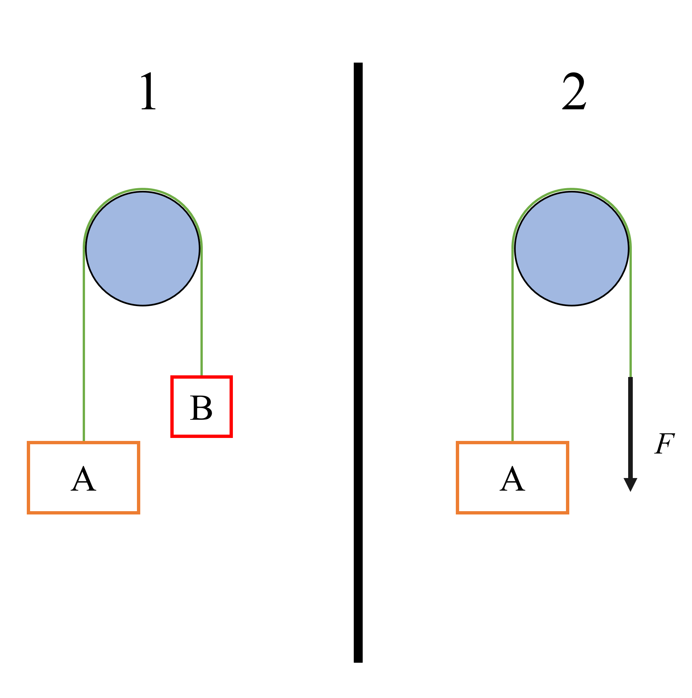

# {{ params_vars_title }}

Examine the scenario in the above image of an Atwood Machine.
In the second image, the box has been replaced by a force such that the tension in the rope is equal to the weight of box B.
Calculate the acceleration of the box A in both scenarios.
Take $W_A = {{ params_Wa }} \ \rm{lb}$, and $W_B = {{ params_Wb }} \ \rm{lb}$
Take upward motion to be positive.

## Part 1

What is the acceleration in Scenario A?

### Answer Section

Please enter in a numeric value in $\rm{ft/s^2}$.

## Part 2

What is the acceleration in Scenario B?

### Answer Section

Please enter in a numeric value in $\rm{ft/s^2}$.

## Attribution

Problem is licensed under the [CC-BY-NC-SA 4.0 license](https://creativecommons.org/licenses/by-nc-sa/4.0/).  