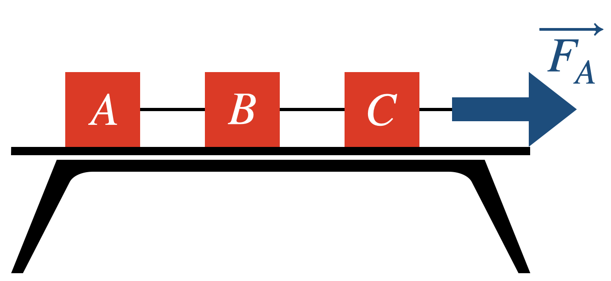

# {{ params.vars.title }}
Blocks A, B, and C are on a frictionless table, connected by massless strings.
Block A has mass {{ params.m1 }} $M$, block B has mass {{ params.m2 }} $M$, and block C has mass {{ params.m3 }} $M$.

Block C is pulled to the right by a large force $F_A$ that causes the entire system to accelerate.

Which of the following statements is true?

## Part 1

Which of the following statements is true?

### Answer Section

- {{ params.part1.ans1.value }}
- {{ params.part1.ans2.value }}
- {{ params.part1.ans3.value }}
- {{ params.part1.ans4.value }}
- {{ params.part1.ans5.value }}

## Attribution

Problem is licensed under the [CC-BY-NC-SA 4.0 license](https://creativecommons.org/licenses/by-nc-sa/4.0/).  