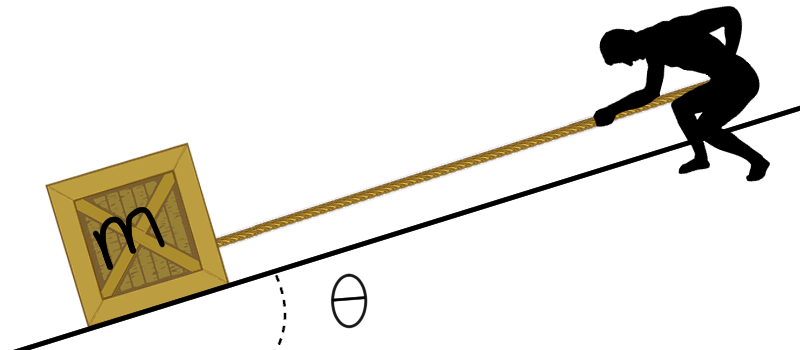

# {{ params_vars_title }}
A ${{params_m}} \ \rm{kg}$ crate is sliding down a ${{params_theta}}^{\circ}$ slope. A man attempts to stop it by pulling uphill on a rope parallel to the slope.

## Part 1

If the coefficient of kinetic friction is ${{params_nu}}$ and the tension of the rope is ${{params_T}} \ \rm{N}$, what is the acceleration of the block?
Enter a negative number if the crate accelerates downwards.

### Answer Section

Please enter in a numeric value in m/s^2.

## Attribution

Problem is licensed under the [CC-BY-NC-SA 4.0 license](https://creativecommons.org/licenses/by-nc-sa/4.0/).  