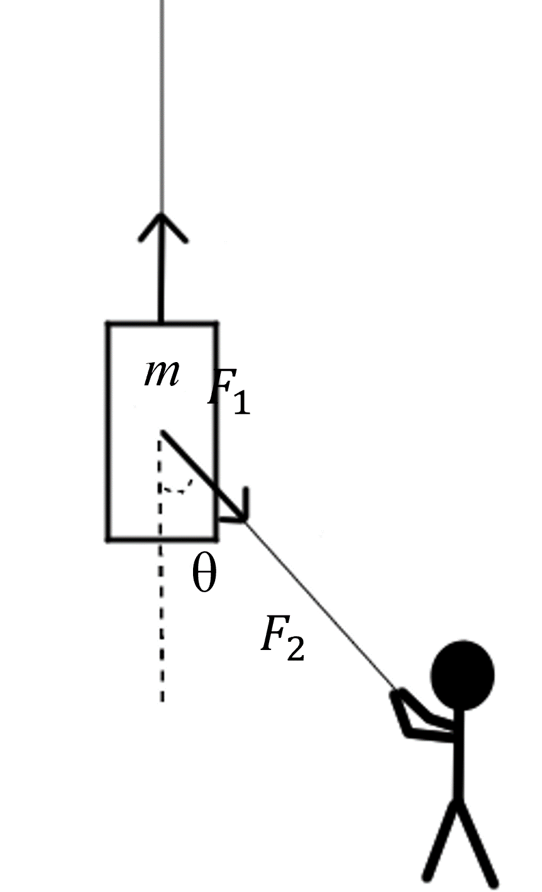

# {{ params_vars_title }}
A crane is lifting a ${{params_m}} \ \rm{kg}$ block.
The tension on the crane's rope is ${{params.F_crane}} \ \rm{N}$.
A construction worker guides the object using a rope angled $\theta={{params_theta}}^{\circ}$ from the vertical.
The worker pulls the rope with a force of ${{params.F_worker}} \ \rm{N}$.

## Part 1

What is the magnitude of the acceleration of the block?

### Answer Section

Please enter in a numeric value in $m/s^2$.

## Part 2

What angle $\alpha$ from the horizontal is the acceleration?

### Answer Section

Please enter in a numeric value in $^{\circ}$.

## Attribution

Problem is licensed under the [CC-BY-NC-SA 4.0 license](https://creativecommons.org/licenses/by-nc-sa/4.0/).  