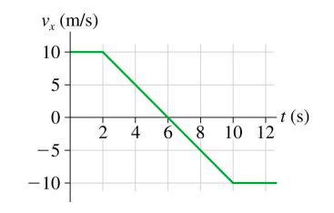

# {{ params.vars.title }}
The velocity as a function of time of an object is as shown in the figure below. The mass of the
object is {{params.m}} $kg$.

## Part 1

Which answer below best describes the force on the object between 2 and 10 $s$?

### Answer Section

- {{ params.part1.ans1.value }}
- {{ params.part1.ans2.value }}
- {{ params.part1.ans3.value }}
- {{ params.part1.ans4.value }}
- {{ params.part1.ans5.value }}

## Attribution

Problem is licensed under the [CC-BY-NC-SA 4.0 license](https://creativecommons.org/licenses/by-nc-sa/4.0/).  