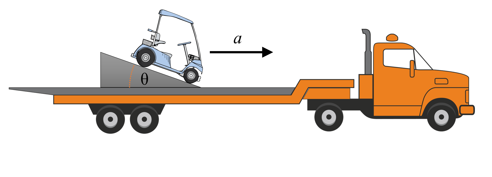

# {{ params.vars.title }}

A truck has a golf cart with no brakes on its back bed.
To prevent it from rolling out, a ramp is installed.
What is the maximum acceleration force that the engine can apply before the cart goes over the ramp and falls out?
The mass of the truck is $M = {{ params.MT }} \ \rm{kg}$, the ramp has an angle $\theta = {{ params.theta }}^{\circ}$, and the cart has a mass $m = {{ params.mc }} \ \rm{kg}$.

## Part 1

### Answer Section

Please enter in a numeric value in $\rm{N}$.

## Attribution

Problem is licensed under the [CC-BY-NC-SA 4.0 license](https://creativecommons.org/licenses/by-nc-sa/4.0/).  