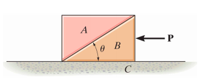

# {{ params.vars.title }}
Blocks A and B each have a mass $m$ = {{params.m}} $kg$.
The coefficient of static friction between $A$ and $B$ is $\mu_s$ = {{params.f}}.
The angle shown is $\theta$ = {{params.t}}$^{\circ}$.
Neglect any friction between $B$ and $C$.

## Question Text

Determine the largest horizontal force $\vec{P}$ that can be applied so that $A$ will not slip on $B$.

### Answer Section

Please enter in a numeric value in {{ params.vars.units }}.

## Attribution

Problem is licensed under the [CC-BY-NC-SA 4.0 license](https://creativecommons.org/licenses/by-nc-sa/4.0/).  