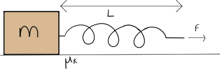

# {{ params_vars_title }}
A person accelerates a ${{params_m}} \ \rm{kg}$ mass at ${{params_a}} \ \rm{m/s^2}$ by pulling on a spring that is ${{params_x}} \ \rm{m}$ long at rest.
The coefficient of friction between the two surfaces is ${{params_nu}}$.

## Part 1

If the spring extends to ${{params_L}} \ \rm{m}$, what is the spring constant $k$?

### Answer Section

Please enter in a numeric value in N/m.

## Attribution

Problem is licensed under the [CC-BY-NC-SA 4.0 license](https://creativecommons.org/licenses/by-nc-sa/4.0/).  