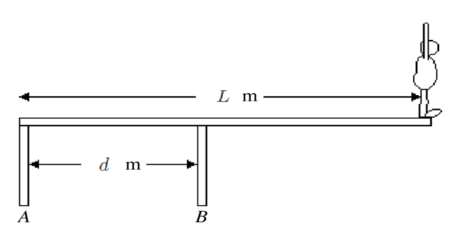

# {{ params_vars_title }}
A $M = $ {{ params_m }} $kg$ diver stands at the edge of a diving board with length $L = $ {{ params_L }} $m$ and negligible mass. The diving board is supported by two narrow pillars. One pillar is located at the end of the diving board furthest from the water and the other is $d = $ {{ params_d }} $m$ towards the water, as shown in the figure.

## Part 1

Show all forces acting on the board. In addition, indicate the pivot point you will be using in the next parts.

Your file must be a pdf.

### Answer Section

File upload box will be shown here.

## Part 2

Find the magnitude of the force exerted on the diving board by pillar $B$ ($F_B$).

### Answer Section

Please enter in a numeric value in {{ params_vars_unit1 }}.

## Part 3

Find the direction, $\theta$, of the force exerted on the diving board by pillar $B$ ($F_B$). Assume that the point where Pillar $B$ touches the board is at the origin of a Cartesian plane ($\theta > 0$ with zero being to the right).

### Answer Section

Please enter in a numeric value in {{ params_vars_unit2 }}.

## Attribution

Problem is licensed under the [CC-BY-NC-SA 4.0 license](https://creativecommons.org/licenses/by-nc-sa/4.0/).  