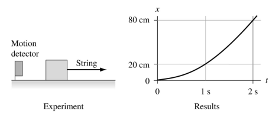

# {{ params.vars.title }}
You have been hired to measure the coefficients of friction for the newly discovered substance jelloium.
Today you will measure the coefficient of kinetic friction for jelloium sliding on steel.
To do so, you pull a {{params.m}} $g$ chunk of jelloium across a horizontal steel table with a constant string tension of {{params.t}} $N$.
A motion detector records the motion and displays the graph shown.

*Hint: The position verses time graph is not a straight line.*

## Question Text

What is the value of $\mu_k$ for jelloium on steel?

### Answer Section

Please enter in a numeric value.

## Attribution

Problem is licensed under the [CC-BY-NC-SA 4.0 license](https://creativecommons.org/licenses/by-nc-sa/4.0/).  