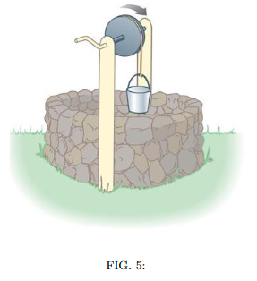

# {{ params_vars_title }}
As shown in the figure, a solid, uniform, frictionless cylindrical reel of mass $M = $ {{ params_M }} $kg$ and radius $R = $ {{ params_R }} $m$ is used to draw water from a well. A bucket of mass $m = $ {{ params_m }} $kg$ is  attached to a massless cord that is wrapped around the cylinder.

## Part 1

If the bucket is released from rest at the top of the well, find the tension $T$ in the cord and the acceleration $a$ of the bucket (the cord does not slip on the reel).

### Answer Section

Please enter in a numeric value in {{ params_vars_unit1 }}.

## Part 2

If the bucket falls for {{ params_t }} $s$ before hitting the water, how far does it fall?

### Answer Section

Please enter in a numeric value in {{ params_vars_unit2 }}.

## Attribution

Problem is licensed under the [CC-BY-NC-SA 4.0 license](https://creativecommons.org/licenses/by-nc-sa/4.0/).  