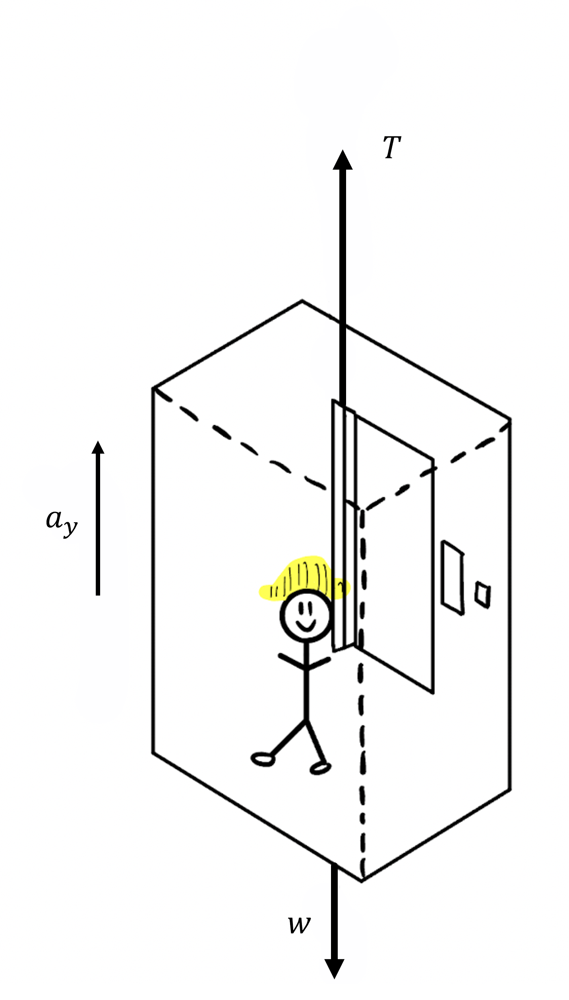

# {{ params_vars_title }}

At a construction site, a worker is on a moving elevator. The tension in the cable is $T = {{ params_tension }} \ \rm{N}$, within the first $t = {{ params_t }} \ \rm{s}$ of movement. If the total mass of the elevator with the worker is $m_2 = {{ params_m2 }} \ \rm{kg}$, what is the velocity of the elevator after the ${{ params_t }} \ \rm{s}$ of start up movement?

## Part 1

### Answer Section

Find the acceleration for the startup movement duration of ${{ params_t }} \ \rm{s}$.
Please enter in a numeric value in {{ params_vars_units }}.

## Part 2

Find the final velocity after ${{ params_t }} \ \rm{s}$.

Please enter in a numeric value in m/s.

## Attribution

Problem is licensed under the [CC-BY-NC-SA 4.0 license](https://creativecommons.org/licenses/by-nc-sa/4.0/).  