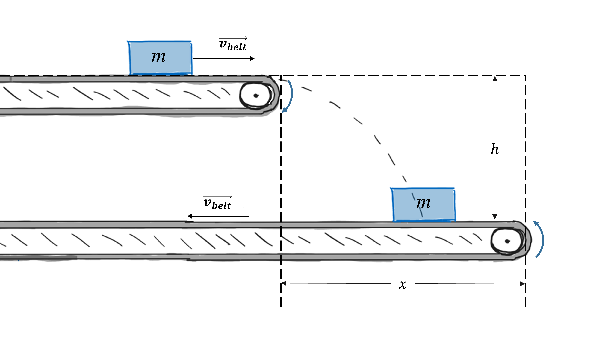

# {{ params.vars.title }}
To minimize space usage and for effective distributed controls, packages on a factory conveyor belt descend via multi-belt sections placed horizontally on different levels with the packages changing directions when dropping from one belt to the other.

## Part 1

If the belts are moving at a speed $v = {{ params.v }} \ \rm{m/s}$ and the package of mass $m = {{ params.M }} \ \rm{kg}$ does not slip relative to the belt prior to descent, what is the angle $\theta$ the resultant contact force vector makes with the belt for the time of impact.
The height between the belts is $h = {{ params.h }} \ \rm{m}$, and the coefficient of friction is $\mu = {{ params.mu }}$
(Hint: The resultant is the vector sum of the normal reaction and friction force)

### Answer Section

Please enter in a numeric value in $\rm{N}$.

## Part 2

If the impact time is $t = {{ params.t }} \ \rm{s}$, determine the minimum extra length $x$ of the conveyor belt for the package to not fall off the belt.

### Answer Section

Please enter in a numeric value in $\rm{N}$.

## Attribution

Problem is licensed under the [CC-BY-NC-SA 4.0 license](https://creativecommons.org/licenses/by-nc-sa/4.0/).  