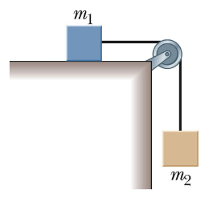

# {{ params.vars.title }}
Because of {{ params.vars.name }}'s excellent work in lab, their professor asks them to test out a new "frictionless" air track, which can be used to measure the acceleration due to gravity.
In {{ params.vars.name }}'s setup, they place a cart with mass $m_1$ = {{ params.m1 }} $g$ on the track and suspend a second mass $m_2$ = {{ params.m2 }} $g$ over a (supposedly) massless, frictionless pulley.
Using a photogate that reads the acceleration of the system at the pulley, {{ params.vars.name }} measures the acceleration in 10 trials as given in the table below.
The uncertainty in each acceleration measurement is $\pm$ {{ params.d_a }} $m/s^2$; the uncertainties in $m_1$ and $m_2$ are negligible.
The mean and standard deviation (SD) of the acceleration data are also given in the table.
Given these data, would you conclude that the air track system is frictionless as claimed?
Justify your answer!

| Trial     | Accel. ($m/s^2$) |
| ----------- | ----------- |
| 1     |  {{ params.a1 }}     |
| 2   |   {{ params.a2 }}      |
| 3     |  {{ params.a3 }}     |
| 4   |   {{ params.a4 }}      |
| 5     |  {{ params.a5 }}     |
| 6   |   {{ params.a6 }}      |
| 7     |  {{ params.a7 }}     |
| 8   |   {{ params.a8 }}      |
| 9     |  {{ params.a9 }}     |
| 10   |   {{ params.a10 }}      |
| **Mean** | {{ params.mean }}      |
| **SD** | {{ params.sd }}      |

## Part 1

Calculate $a\_{expected}$.

### Answer Section

Please enter in a numeric value in {{ params.vars.units }}.

## Part 2

Calculate $a\_{measured}$.

### Answer Section

Please enter in a numeric value in {{ params.vars.units }}.

## Part 3

Calculate the standard error of $a\_{measured}$.

### Answer Section

Please enter in a numeric value in {{ params.vars.units }}.

## Part 4

Would you conclude that the air track system is frictionless as claimed? Justify your answer!

### Answer Section

- {{ params.part4.ans1.value}}
- {{ params.part4.ans2.value}}
- {{ params.part4.ans3.value}}
- {{ params.part4.ans4.value}}

## Attribution

Problem is licensed under the [CC-BY-NC-SA 4.0 license](https://creativecommons.org/licenses/by-nc-sa/4.0/).  