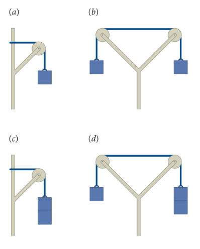

# {{ params.vars.title }}
All the blocks in the figure below are identical and you can ignore any friction in the massless pulleys.

 

<h5>Long Description of image: Figure of four pulley systems.</h5>
System A is a simple pulley system using one block. 
System B is a double pulley system using one block on each side. 
System C is a simple pulley system using two blocks. 
System D is a double pulley system using one block on the left side and two blocks on the right.

Long description ends.

## Part 1

In which of the figures is the tension in the rope the greatest?

### Answer Section

- {{ params.part1.ans1.value }}
- {{ params.part1.ans2.value }}
- {{ params.part1.ans3.value }}
- {{ params.part1.ans4.value }}

## Attribution

Problem is licensed under the [CC-BY-NC-SA 4.0 license](https://creativecommons.org/licenses/by-nc-sa/4.0/).  