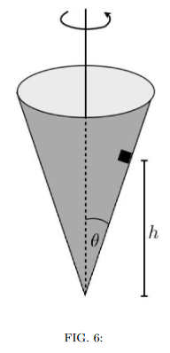

# {{ params.vars.title }}

## Question Text

As shown in the figure, a small block of mass $m$ is placed inside an inverted cone that is rotating around a vertical axis with period $T$. The walls of the cone are frictionless and make an angle $\theta$ with the vertical.  What is the value of $T$ if the block is to remain at a height $h$ above the apex of the cone? Give  your answer for $T$ in terms of $m$, $h$, $g$, and $\theta$.

Note that it may not be necessary to use every variable. Use the following table as a reference for using each variable:

| $Variable$ | Use   |
|----------|-------|
| $m$  | m  |
| $h$  | h  |
| $g$      | g     |
| $\theta$ | theta |

### Answer Section

## Attribution

Problem is licensed under the [CC-BY-NC-SA 4.0 license](https://creativecommons.org/licenses/by-nc-sa/4.0/).  