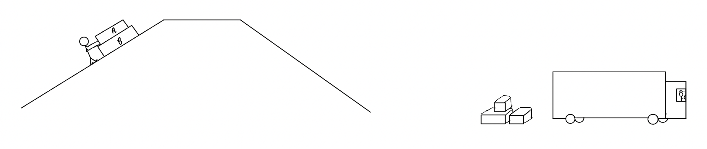

# {{ params_vars_title }}
A mover is pushing crates $A$ and $B$ up a hill, in order for them to slide down the hill for loading. Crate $A$ has a mass of $m_1 = {{ params_m1 }} \ \rm{kg}$ and crate $B$ has a mass of $m_2 = {{ params_m2 }} \ \rm{kg}$. The hill has an inclination of $\theta = {{ params_theta }}^\circ$, and is frictionless.

## Part 1

What is the force needed to push both crates up the hill with no acceleration?

### Answer Section

Please enter in a numeric value in {{ params_vars_units }}.

## Part 2

The mover gets tired, and decides to leave the crates alone for a moment to take a break. What is the magnitude of acceleration the crates now face?

### Answer Section

Please enter in a numeric value in m/s$^2$.

## Part 3

If the crates were left with an velocity of $v_o = {{ params_vo }} \ \rm{m/s}$, how far up the hill will they still go?

### Answer Section

Please enter in a numeric value in m.

## Attribution

Problem is licensed under the [CC-BY-NC-SA 4.0 license](https://creativecommons.org/licenses/by-nc-sa/4.0/).  