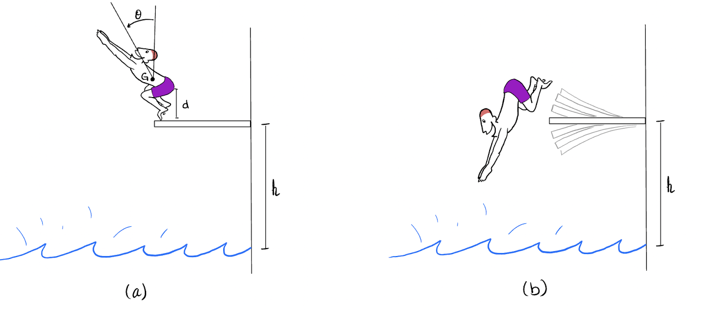

# {{ params_vars_title }}

A diver is practicing their dives for the Olympics! They have a weight of $W = {{ params_W }} \ \rm{lb}$. In figure (**a**), their center of gravity is $d = {{ params_d }} \ \rm{ft}$ from the board, and the rotation radius about their center of gravity is $k_G = {{ params_k }} \ \rm{ft}$. When they jump off the board, an angle of ${{ params_theta }}^\circ$ is made from the board. The height of the board is $h = {{ params_h }} \ \rm{ft}$ from the water.

## Part 1

What is the angular velocity of the diver as they jump off the board?
(Hint: Consider the energy from their centre of gravity, and how it realates to their rotational movement)

### Answer Section

Please enter in a numeric value in {{ params_vars_units }}.

## Part 2

How many revolutions do they complete before they land in the water?

### Answer Section

Please enter in a numeric value in {{ params_vars_units }}.

## Attribution

Problem is licensed under the [CC-BY-NC-SA 4.0 license](https://creativecommons.org/licenses/by-nc-sa/4.0/).  