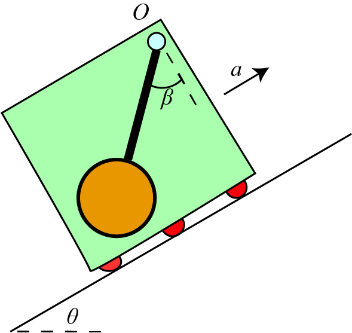

# {{ params.vars.title }}

## Question Text

A pendulum is attached to a cart moving up hill, and is free to swing in the vertical plane of the cart.
If the cart has a constant acceleration $a = {{params.a}}m/s^2$ up the hill, which is inclined at ${{params.theta}}^{\circ}$,
then what is the angle $\beta$ created by the pendulum after all startup movement has ceased?

### Answer Section

Please enter an numerical value in ${{ params.vars.units }}$.

## Attribution

Problem is licensed under the [CC-BY-NC-SA 4.0 license](https://creativecommons.org/licenses/by-nc-sa/4.0/).  