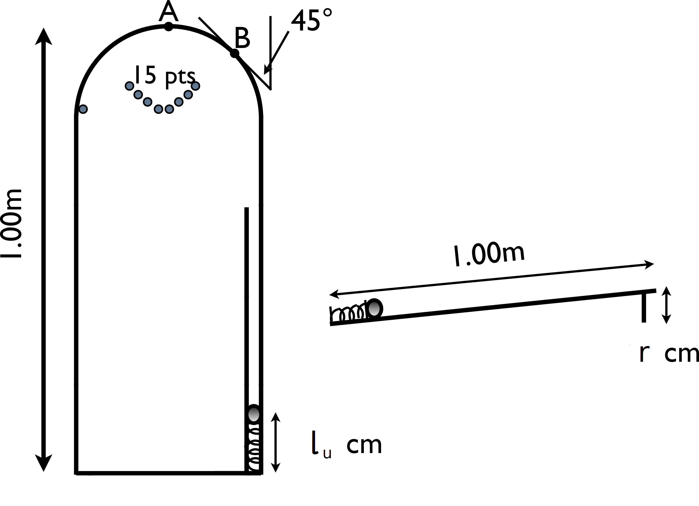

# {{ params_vars_title }}
A precursor of pinball machines involved manually pushing down on a ball suspended atop of a spring in a track that allows the ball only to travel up a ramp as shown in the figure.  The unstretched spring has a length of $l_u=$ {{ params.l_u }} $cm$, over the 1.00 $m$ length of the board the track rises by $r=$ {{ params_rise }} $cm$, and the top of the board is circular, with a radius of {{ params_radius }}.0 $cm$.

Treat the ball as a particle of mass $m$ = {{ params.m_b }} $g$, (treating it as a sphere would give a small additional term to the kinetic energy) and ignore friction.

## Part 1

Write the free body diagram for the ball at the top of the loop, and use this to solve for the minimum speed required by the ball at this point for the ball to remain in circular motion at the top of its arc.

### Answer Section

Please enter in a numeric value in $m/s$.

## Part 2

Can the normal force due to the walls of the track ever do work on the ball?  Explain your answer.

### Answer Section

- {{ params_part2_ans1_value}}
- {{ params_part2_ans2_value}}
- {{ params_part2_ans3_value}}
- {{ params_part2_ans4_value}}

## Part 3

If the spring was initially compressed to a length of {{ params.l_c }} $cm$ prior to its release, and it had the minimum speed to remain in circular motion when it reached the top, find the value of the spring constant, $k$.

### Answer Section

Please enter in a numeric value in $N/m$.

## Part 4

A ball leaving the wall at position B will land for 15 points.

What value does the normal force (from the ends of the track) take at the point where the ball first leaves the wall?

### Answer Section

- {{ params_part4_ans1_value}}
- {{ params_part4_ans2_value}}
- {{ params_part4_ans3_value}}
- {{ params_part4_ans4_value}}

## Attribution

Problem is licensed under the [CC-BY-NC-SA 4.0 license](https://creativecommons.org/licenses/by-nc-sa/4.0/).  