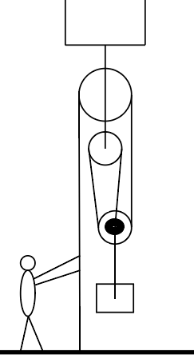

# {{ params_vars_title }}

## Question Text

The worker shown pulls the rope with a force of ${{params_f}}lb$.
Find the acceleration $a$ of the  ${{params_m}}lb$ crate.
Neglect mass of the ropes, and pulleys.

### Answer Section

Please enter a value in ${{ params_vars_units }}$.

## Attribution

Problem is licensed under the [CC-BY-NC-SA 4.0 license](https://creativecommons.org/licenses/by-nc-sa/4.0/).  