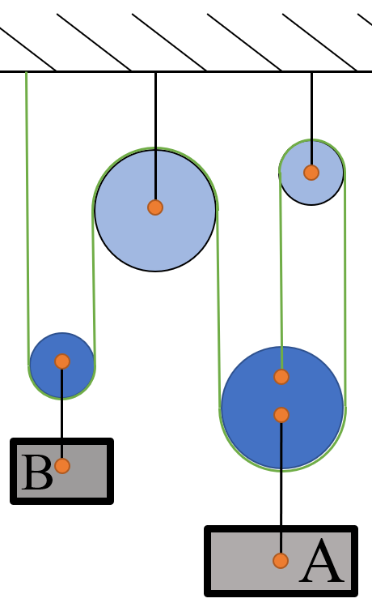

# {{ params_vars_title }}

Shown above is a system of pulleys in equilibrium. The container labeled A has a weight of $W = {{ params_m }} \ \rm{lb}$.

## Part 1

Find the tension in the cables.

### Answer Section

Please enter in a numeric value in {{ params_vars_units }}.

## Part 2

Find the mass of the container labeled B.

### Answer Section

Please enter in a numeric value in {{ params_vars_units }}.

## Attribution

Problem is licensed under the [CC-BY-NC-SA 4.0 license](https://creativecommons.org/licenses/by-nc-sa/4.0/).  