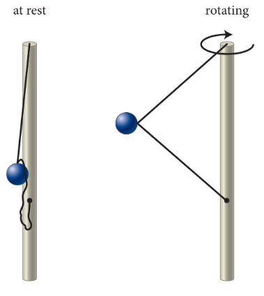

# {{ params.vars.title }}
A ball is attached to a vertical rod by two strings of equal strength and length. One end of the top string is attached to the very top of the rod, and one end of the bottom string is attached partway down the rod. The other ends of both strings attach to a single ball. The rod begins to rotate clockwise with a rotational speed that continuously increases.

## Part 1

Which string breaks first?

### Answer Section

- {{ params.part1.ans1.value }}
- {{ params.part1.ans2.value }}
- {{ params.part1.ans3.value }}
- {{ params.part1.ans4.value }}
- {{ params.part1.ans5.value }}

## Attribution

Problem is licensed under the [CC-BY-NC-SA 4.0 license](https://creativecommons.org/licenses/by-nc-sa/4.0/).  