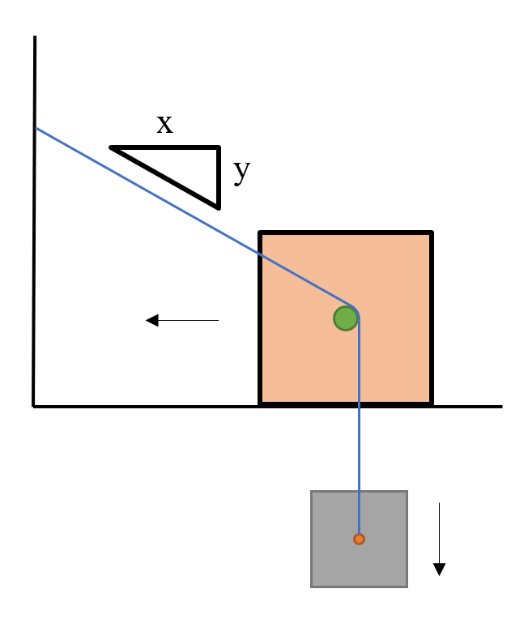

# {{ params_vars_title }}

When workforce is limited, solutions are needed to reduce the number of people needed.
An engineer comes up with the system in the diagram above, which seeks to autonomously limit the acceleration of a supply crate into a pit, without it needing to be manually controlled.
Find the acceleration of the supply crate, and the tension in the rope.
Assume the system starts from rest, the top block has a mass $M = {{ params_Ma }} \ \rm{kg}$, the supply crate has a mass $m = {{ params_mb }} \ \rm{kg}$, and the coefficient of static friction is equal to the kinetic friction, with a value of ${{ params_mu }}$.
Assume $x = {{ params_x }}$ and $y = {{ params_y }}$

## Part 1

What is the acceleration?

### Answer Section

Please enter in a numeric value in $\rm{m}$.

## Part 2

What is the tension?

### Answer Section

Please enter in a numeric value in $\rm{m}$.

## Attribution

Problem is licensed under the [CC-BY-NC-SA 4.0 license](https://creativecommons.org/licenses/by-nc-sa/4.0/).  